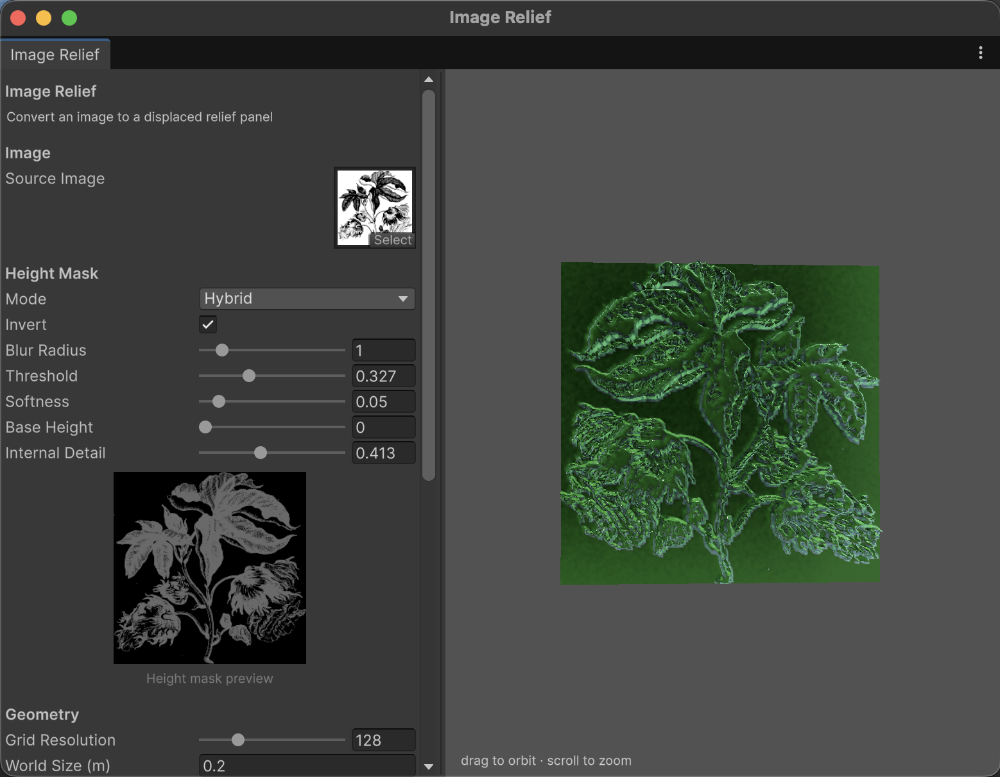
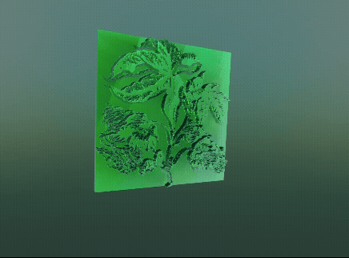

# Image Relief

A Unity editor tool that converts an image into a **3D displacement relief panel** — logos, photographs, hand-drawn art. Drop in a source image, tune the height mask, watch the mesh rebuild live, and export a mesh, normal map, material, and prefab with one click.

Open it from **Tools ▸ Image Relief**.



---

## Features

- **Three mask modes.** *Luminance* maps brightness smoothly to height. *Threshold* cuts a hard silhouette with adjustable softness. *Hybrid* combines both — threshold defines the shape, internal luminance adds surface detail.
- **Blur and invert** controls on the height field.
- **2D mask preview** — grayscale thumbnail of the computed height field.
- **Live 3D preview.** Drag to orbit, scroll to zoom; the camera persists across edits.
- **Optional base slab.** Side walls and a back face for a watertight solid panel.
- **Edge clamping** to force a flat frame around the relief.
- **Baked normal map** via Sobel-filter gradient — adds surface detail without extra triangles.
- **One-click export** — mesh `.asset`, normal map PNG, material, and prefab into a folder you choose.



## Installation

### Via Package Manager (Git URL) — recommended

1. In Unity, open **Window ▸ Package Manager**.
2. Click **+** ▸ **Add package from git URL…**
3. Paste:
   ```
   https://github.com/hbjeletich/ImageRelief.git
   ```
4. To pin to a release, append a tag: `…ImageRelief.git#v1.0.0`

Requires Git on your `PATH`.

### Manual

Copy the repo into your project's `Packages/` or `Assets/` directory. The included assembly definitions keep runtime and editor code correctly separated either way.

### Requirements

- **Unity 2020.2 or newer.**
- Built-in (`Standard`) or URP (`Universal Render Pipeline/Lit`) — the tool picks whichever is present.
- Source textures need **Read/Write** enabled. The tool detects when this is missing and offers a one-click fix.

## Usage

1. Open **Tools ▸ Image Relief**.
2. Drag a texture into **Source Image**. Click **Make Readable** if prompted.
3. Pick a **Mask Mode** and tune the height mask until the grayscale preview looks right.
4. Set **Grid Resolution**, **World Size**, **Height Scale**, and optionally enable **Clamp Edges** or **Add Base Slab**.
5. Adjust **Normal Map** strength and resolution.
6. Set color, metallic, and roughness.
7. Enter a **Folder** and **Name**, then click **Save Relief + Prefab**.

## Architecture

```
Runtime/
  ReliefSettings.cs       All settings (image, mask, geometry, normal map).
  HeightMaskBuilder.cs    Image → float[,] height field (luminance, blur, mask modes).
  ReliefMeshBuilder.cs    Height field → Mesh (aspect-correct grid, skirt, back face).
  ReliefNormalBaker.cs    Height field → tangent-space normal map via Sobel filter.

Editor/
  ReliefWindow.cs         The Tools ▸ Image Relief window (preview, settings, export).
```

Nothing in `Runtime/` references editor APIs, so mesh and normal-map generation can be driven at runtime or from a build script.

### Mask modes

| Mode | Behaviour |
|---|---|
| **Luminance** | Brightness → height directly. Best for smooth gradients. |
| **Threshold** | Smoothstep cutoff produces a hard silhouette. Best for logos. |
| **Hybrid** | Threshold mask × `(baseHeight + internalDetail × luminance)`. Best for photographs with a defined shape but internal surface detail. |

## License

MIT — see [LICENSE.md](LICENSE.md).
